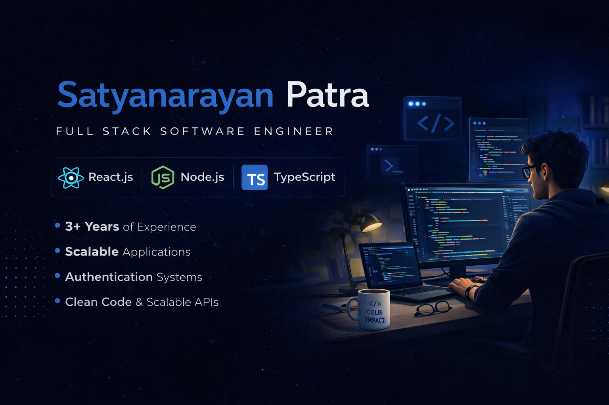

<picture>
  <source media="(prefers-color-scheme: dark)" srcset="./assets/banner-dark.png">
  <source media="(prefers-color-scheme: light)" srcset="./assets/banner-light.png">
  <!--  -->
</picture>

# Hi 👋 I'm Satyanarayan Patra

### Full Stack Software Engineer | 3+ Years Experience

### React.js • Node.js • TypeScript • Next.js • Scalable Web Applications

---

## 🚀 About Me

💼 Software Engineer with **3+ years of experience** building production-grade applications across **FinTech, SaaS, enterprise, and client-facing platforms**.

⚡ Specialized in:

- ⚛️ React.js / Next.js / Redux / TypeScript  
- 🟢 Node.js / Express.js / REST APIs  
- 🗄️ MySQL / MongoDB / PostgreSQL  
- 🔐 JWT / MFA / RBAC / Secure Systems  
- ☁️ AWS / Azure / CI/CD / GitHub Actions  
- 🧪 Playwright / Automation / Testing  

🎯 Focused on solving real business problems with scalable architecture, clean code, and high-performance engineering.

📍 India | Open to Opportunities | Immediate Joiner

---

## 🛠️ Tech Stack

### Frontend

### Backend

### Database

### DevOps / Tools

---

## 🏆 Professional Highlights

✅ Improved UI responsiveness & user experience through optimization initiatives  

✅ Built secure authentication systems using **JWT + MFA + RBAC**

✅ Developed production-grade APIs with Node.js + SQL workflows

✅ Led frontend modernization reducing technical debt & improving maintainability

✅ Worked in Agile teams delivering high-impact features on tight timelines

---

## 🚀 Featured Projects

### 🔹 Job Outreach CLI
TypeScript automation tool for lead management, outreach workflows, recruiter follow-ups, and productivity pipelines.

### 🔹 Full Stack Student Management System
React + Node.js + PostgreSQL application with CRUD, pagination, validations, and scalable backend design.

### 🔹 SaaS Pricing Platform
Responsive pricing UI built using Next.js + Tailwind CSS with accessibility and animations.

### 🔹 Enterprise FinTech Platform Contributions
Worked on scalable UI systems, secure document workflows, backend integrations, and product enhancements.

---

## 📈 GitHub Analytics

<picture>
  <source media="(prefers-color-scheme: dark)" srcset="https://github-readme-stats.vercel.app/api?username=SatyanarayanPatra&show_icons=true&theme=tokyonight&hide_border=true">
  <source media="(prefers-color-scheme: light)" srcset="https://github-readme-stats.vercel.app/api?username=SatyanarayanPatra&show_icons=true&theme=default&hide_border=true">
  
</picture>

  

  

---

## 🧠 Engineering Principles

✔️ Clean Code > Clever Code  
✔️ Build for Scale  
✔️ Security by Design  
✔️ Performance Matters  
✔️ Ownership Mindset  
✔️ User Experience First  

---

## 🌐 Connect With Me

---

### ⭐ Building software that creates impact

